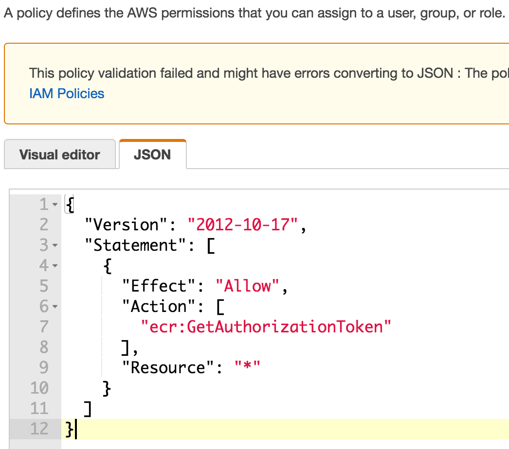
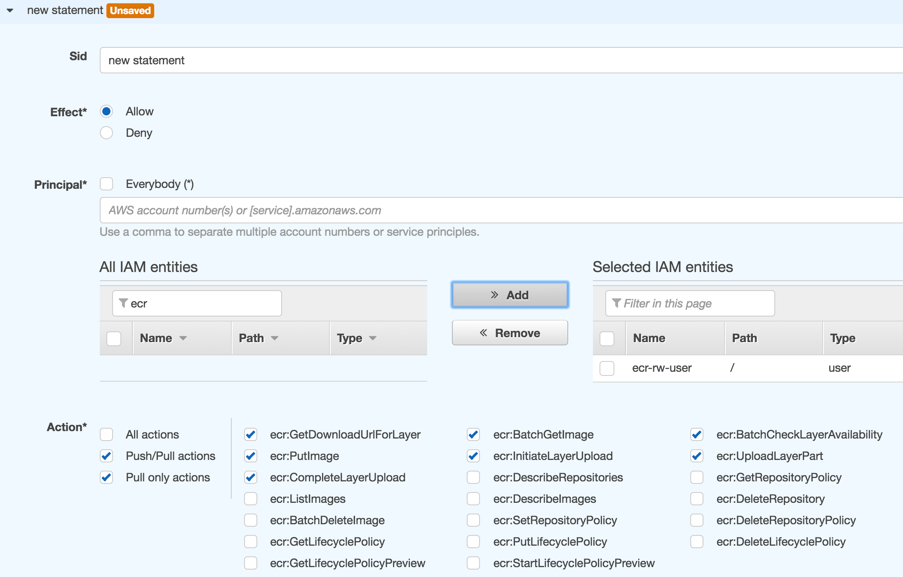

# Getting Started

Setting up the AWS infrastructure and configuring settings to push a Docker image to a private Amazon ECR repository.
 
### Requirements
 - Java 7+
 - [AWS CLI](https://aws.amazon.com/cli/)
 - [Amazon-ecr-credential-helper](https://github.com/awslabs/amazon-ecr-credential-helper)
 - [Go](https://golang.org/dl/), required by amazon-ecr-credential-helper
 
### Installing dependencies
 - [AWS CLI](https://aws.amazon.com/cli/)
    - Download & install AWS CLI, make sure its added in path
    - Open command prompt & type `aws --version` Output `aws-cli/2.0.6 Python/3.7.5 Windows/10 botocore/2.0.0dev10`
 - [Go](https://golang.org/dl/)
    - Download & install Go, make sure its added in path
    - Open command prompt & type `go version` Output `go version go1.14.1 windows/amd64`
 - [Amazon-ecr-credential-helper](https://github.com/awslabs/amazon-ecr-credential-helper)
    - Install Amazon-ecr-credential-helper via `go get` with:      
        ```
        go get -u github.com/awslabs/amazon-ecr-credential-helper/ecr-login/cli/docker-credential-ecr-login
        ```
    - To check its working correctly open command prompt & type `docker-credential-ecr-login version` Output  `0.6.3`

### Setup the aws infrastructure
Let’s create an IAM user with privileges to pull and push Docker images from a private ECR repository:
 - Create aws iam policy
    - Open [AWS IAM policies web page](https://console.aws.amazon.com/iam/home#/policies)
    - Click **Create policy** button
    - Click **JSON** tab and enter this policy code:
      
    - Create an **AWS IAM Policy** for ECR - JSON code    
    - Click **Review policy** button
    - Name it **ecr-authOnly-policy** and click **Create policy** button
    - Now add policy to any **AWS IAM User**
    
 - Create AWS ECR Repository
    - Open [AWS ECR Web page](https://us-east-1.console.aws.amazon.com/ecr)
    - After entering the repo name, Click **Create repository** button
    - Create an AWS ECR repository - Permissions
     
    - Click **save all** button
    
This is all we need to setup the AWS infrastructure to push private Docker images. Lets now configure the development or build environment.     

### Update GOOGLE JIB configuration
 - Update `gradle/docker.gradle`
    >  Note: Replace xxxxxxxxxxxx with the id generated while creating the ECR repository.

Instead of pushing resulting image to a public Docker hub repository, We are going to push it to a private Elastic Container Registry repository. But first lets update some configuration settings.

### Local Docker, AWS PERMISSIONS configuration
 - Let’s add a couple of configurations to be able to login to the Amazon ECR repository with specific AWS IAM entity credentials:
     ```
        cat ~/.docker/config.json
        {
          "credHelpers": {
            "xxxxxxxxxxxx.dkr.ecr.us-east-1.amazonaws.com": "ecr-login"
          }
        }
     ```
     >  Note: Replace xxxxxxxxxxxx with the id generated while creating the ECR repository.
 - Quickly Configuring the AWS CLI
    - For general use, the `aws configure` command is the fastest way to set up your AWS CLI installation. The following example shows sample values. Replace them with your own values as described in the following sections.
        ```
          $ aws configure
          AWS Access Key ID [None]: XXXXXX
          AWS Secret Access Key [None]: XXXXXX
          Default region name [None]: us-XXXXXX-1
          Default output format [None]: json
        ```
      >  When we enter this command, the AWS CLI prompts for four pieces of information (access key, secret access key, AWS Region, and output format). The AWS CLI stores this information in a profile (a collection of settings) named default. The information in the default profile is used any time we run an AWS CLI command that doesn't explicitly specify a profile to use.
                                                                                                                                                                                                                                                                                                                                                                                                                                                                              >   
### Building and Pushing the Docker Image
 - Go to project root folder & type below gradle command
    ```
    $ ./gradlew jib
   ```
 - Jib uses default **AWS** Profile from `~/.aws/credentials.`
 - Log into [AWS Management Console](https://aws.amazon.com/console/), check under **ECR** repo. there will be image.
 
 ### References
  - [https://docs.aws.amazon.com/cli/latest/userguide/installing.html](https://docs.aws.amazon.com/cli/latest/userguide/installing.html)
  - [https://docs.aws.amazon.com/cli/latest/userguide/cli-install-macos.html](https://docs.aws.amazon.com/cli/latest/userguide/cli-install-macos.html)
  - [https://docs.aws.amazon.com/AmazonECR/latest/userguide/ecr_managed_policies.html](https://docs.aws.amazon.com/AmazonECR/latest/userguide/ecr_managed_policies.html)
  - [https://golang.org/doc/install](https://golang.org/doc/install)
  - [https://github.com/awslabs/amazon-ecr-credential-helper](https://github.com/awslabs/amazon-ecr-credential-helper)
  - [https://docs.docker.com/engine/reference/commandline/cli/](https://docs.docker.com/engine/reference/commandline/cli/)

  
